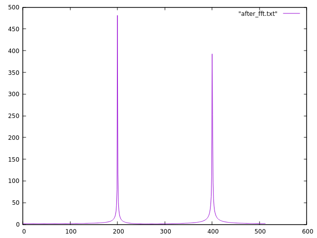

# Fortran - Zadanie 2
---
## Opis zadania
Dokładny opis zadania znajduje się [tutaj](http://home.agh.edu.pl/~macwozni/fort/zadanie2.pdf). 
Pliki modułów znajdują się w folderze **src/** a wykresy wynikowe wygenerowane przy pomocy *gnuplota* znajdują się w folderze **res/**.

## Część pierwsza
Dla sygnału postaci wykonano FFT.

Wynik działania programu widoczny jest na wykresie poniżej:

## Część druga
Wykres wybranej funkcji cosinus:

Wykres powyższej funkcji po dodaniu szumu:

Po wykonaniu FFT:

Po wykonaniu odwróconej FFT:

Jak widać powyżej, usuwanie szumów przebiegło pomyślnie.
